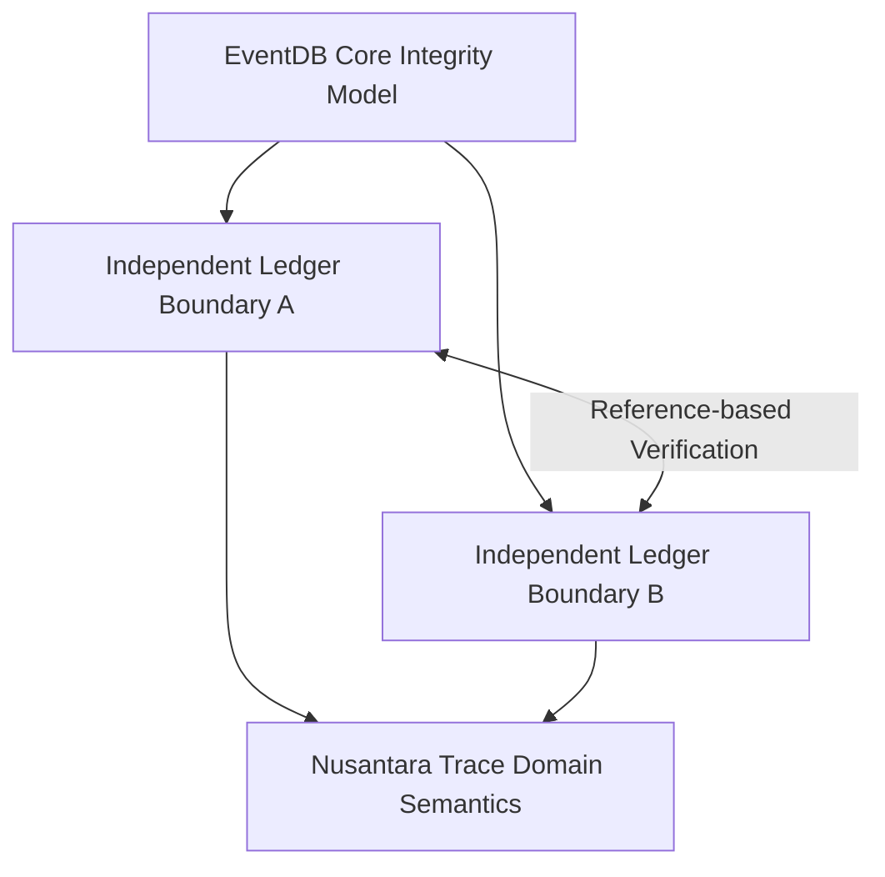
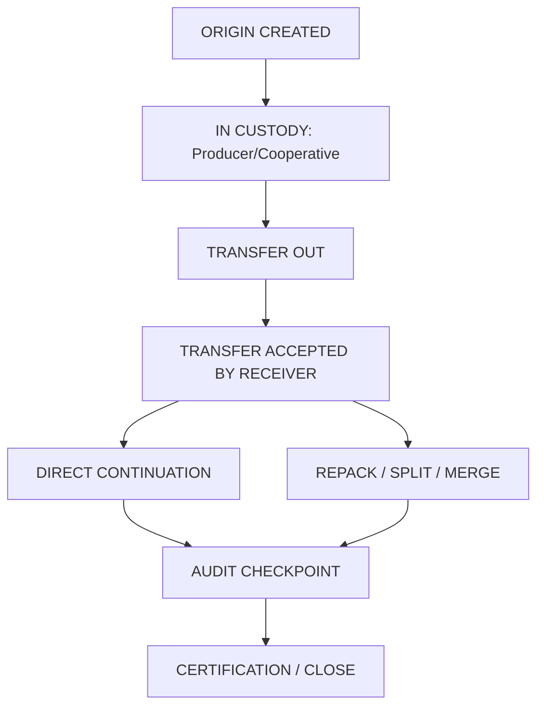
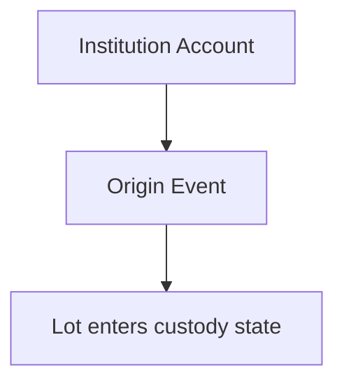
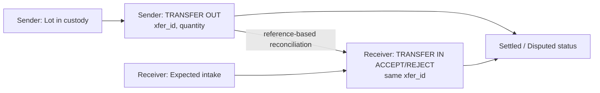
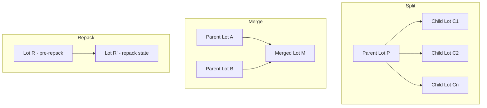
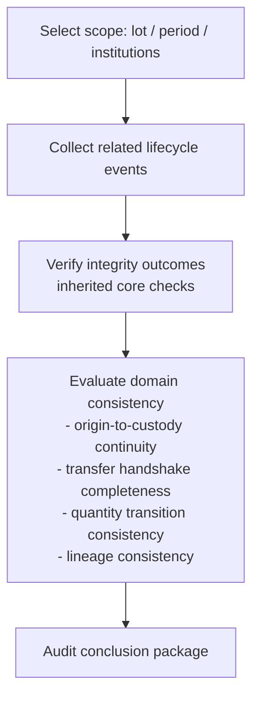

# 07-traceability-model.md
Nusantara Trace - Traceability Model
Version: 0.1
Status: Draft

This section defines the conceptual traceability model for Nusantara Trace as a domain profile over EventDB Core.

## 1. Model Overview

The model represents a product unit (asset/lot) as a lifecycle of accountable domain events. Each lifecycle transition is recorded by an institution that has operational responsibility at that stage.

Nusantara Trace defines domain semantics for lifecycle interpretation. Integrity verification of recorded events is inherited from EventDB Core.

Conceptual layer view:

## 2. Asset/Lot Lifecycle

A traceable asset/lot progresses through a bounded set of domain states.

Conceptual lifecycle diagram:

This lifecycle is append-only at the evidence level: updates are expressed as new events, not history replacement.

## 3. Origin Creation

Origin creation is the initial trace statement for an asset/lot within institutional scope. It establishes baseline identity and source context for downstream custody interpretation.

Conceptual origin declaration:

Origin creation does not by itself prove physical authenticity. It provides an accountable statement that can be evaluated against subsequent events and external evidence.

## 4. Custody Transfer

Custody transfer is modeled as a bilateral process across two institution boundaries. A transfer is interpreted from two accountable statements: sender transfer-out and receiver acceptance or rejection.

Conceptual transfer diagram:

This model makes mismatch conditions explicit. If transferred and accepted quantities differ, the discrepancy is represented as a traceable domain outcome.

## 4.x Cross-Boundary Reference Clarification

When Institution A references transfer evidence produced by Institution B, the reference SHOULD include the minimum proof locator set:

- `namespace_id` (if applicable under deployment policy)
- `chain_id`
- `event_id`
- seal reference (if seal-based checkpoint reference is used)

These identifiers define what is being referenced for verification. They do not change ledger ownership or execution scope.

- Cross-boundary referencing MUST NOT be interpreted as boundary merge.
- Referential integrity MUST NOT be interpreted as shared mutable state.
- Verification MUST be performed as local replay/verification of referenced proof material under the verifier's own policy context.

## 5. Repack, Split, and Merge

Processing operations may transform one lot into many lots, many lots into one, or repackage the same lot under new handling context. Nusantara Trace models these as lineage-preserving transitions.

Conceptual lineage diagrams:

In all three cases, lineage references preserve parent-child relationships so auditors can reconstruct provenance paths across transformations.

## 6. Audit Checkpoint

An audit checkpoint is a review stage where a verifier assesses whether the recorded lifecycle remains internally consistent and evidentially complete for the declared scope.

Conceptual audit checkpoint flow:

The audit checkpoint does not redefine core integrity functions. It applies profile-level interpretation rules to a verified event history.

## 7. Interpretation Boundary

Responsibility separation remains mandatory:

- EventDB Core (inherited) provides integrity evidence for event continuity and accountability.
- Nusantara Trace provides domain interpretation of lifecycle transitions and cross-institution custody semantics.

Therefore, a positive integrity result indicates that recorded statements are tamper-evident and attributable. It does not, by itself, establish physical truth without external corroboration.
