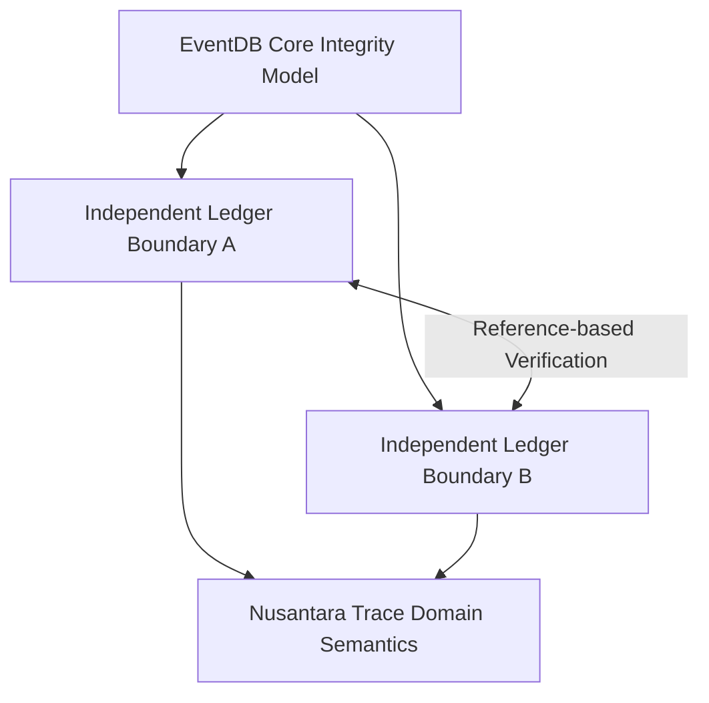
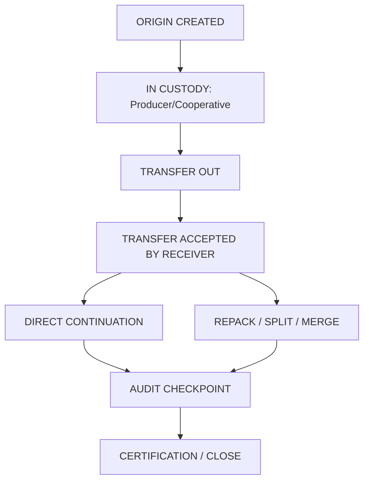
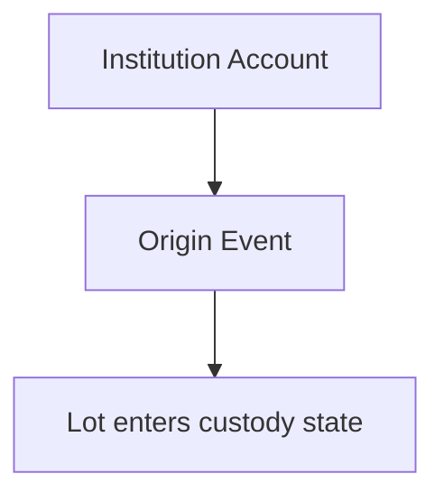
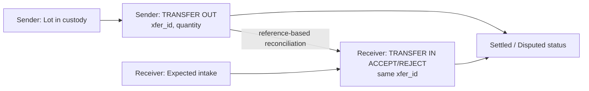
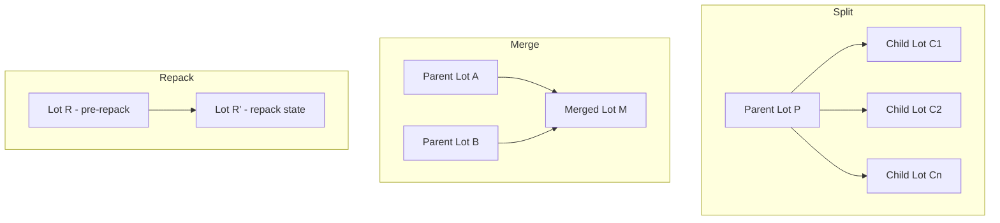
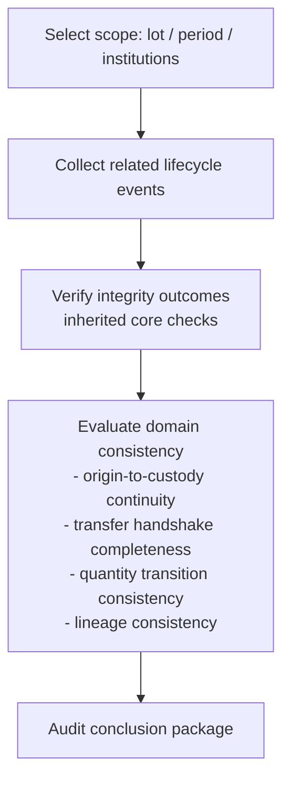

% Nusantara Trace: Institution-Aware Traceability Profile over EventDB Core
% Version 0.1
% 2026-03-01

# Nusantara Trace: Institution-Aware Traceability Profile over EventDB Core

# 01-abstract.md
Nusantara Trace - Abstract
Version: 0.1
Status: Draft


Supply chain traceability remains difficult in multi-actor agricultural systems where records pass through cooperatives, processors, exporters, certifiers, and regulators. In practice, origin claims, custody handovers, and quantity transitions are often recorded in separate databases with limited cross-organization verification. This creates recurring risks: unverified origin attribution, unresolved transfer discrepancies, and audit processes that depend on post-hoc document assembly.

Current digital approaches present a structural gap. Conventional ERP systems support operational workflows and institutional control, but they are not designed to provide deterministic tamper-evident history across independent organizations. Public blockchain approaches, by contrast, emphasize shared publication and consensus but can introduce governance mismatch, operational overhead, and adoption barriers in regulated institutional settings. Many stakeholders therefore face a binary choice between systems that are operationally practical and systems that are integrity-oriented.

Nusantara Trace is introduced as a hybrid approach that bridges this gap. It is defined as a domain profile for traceability that operates on top of EventDB Core, rather than an alternative integrity engine. The integrity layer is inherited from EventDB Core, and Nusantara Trace depends on that foundation for verifiable event continuity and accountable record evidence. Nusantara Trace itself defines domain semantics for custody and traceability interpretation.

The model adopts a federated transfer structure: each institution maintains its own accountable record domain, while inter-institution transfers are treated as bilateral, reconcilable statements rather than centralized declarations. This supports cross-party verification while preserving organizational governance boundaries.

Coffee is used as the reference agricultural use case because it presents clear custody stages, export-facing compliance requirements, and frequent traceability disputes, making it suitable for profile definition and validation.

The contribution of this paper is a regulator-oriented, domain-specific traceability profile that separates integrity from business semantics, specifies a federated institutional interaction model, and provides a practical conceptual bridge between ERP-centered operations and blockchain-oriented integrity assumptions without adopting either as an exclusive model.

# 02-introduction.md
Nusantara Trace - Introduction
Version: 0.1
Status: Draft


Supply chain actors require records that can be audited across organizational boundaries. Existing ERP workflows are effective for operations, but mutable records and fragmented handover evidence create assurance gaps during inspection, dispute, and certification.

Nusantara Trace addresses this by defining a domain profile that runs on EventDB Core.

## Layer Separation

### Inherited integrity layer (EventDB Core)

The following mechanisms are inherited and MUST be implemented as specified by EventDB Core:
- Event envelope validation
- Canonical hashing and previous-hash linkage
- Signature verification
- Window sealing
- Snapshot derivation and verification
- Optional external anchor publication and proof verification

### Nusantara Trace profile layer

The profile layer defines domain rules for:
- Origin declaration data requirements
- Transfer handshake semantics between institutions
- Quantity and state transition constraints
- Audit and certification evidence packaging
- QR pointer usage for public lookup and inspection workflows

Nusantara Trace is institution-centric and federation-compatible. Each institution controls its own account governance and operational policy. Cross-institution verification is performed through deterministic exchange of event references and signatures, not through ideological decentralization claims.

## 3.x Ledger Boundary Alignment

Nusantara Trace operates strictly within the Ledger Boundary model defined by EventDB Core.

- Each institution MUST maintain sovereign control over its own ledger boundary, including event issuance authority, signing authority governance, and operational policy.
- A ledger boundary MUST be treated as an integrity isolation unit for verification and accountability, and MUST NOT be treated as a domain classification mechanism.
- Cross-institution interaction MUST occur through verifiable cross-boundary event references; participating institutions MUST NOT assume shared mutable state across boundaries.
- Transfer and reconciliation outcomes MUST be derived from independently recorded statements that are correlated by profile rules, consistent with federated boundary operation.

# 03-problem-statement.md
Nusantara Trace - Problem Statement
Version: 0.1
Status: Draft


Supply chain traceability is expected to support operational coordination, quality assurance, export documentation, certification review, and regulatory inspection. In agricultural chains, this is difficult because records are generated by many institutions with different systems and responsibilities. The result is a recurring gap between what stakeholders need to verify and what existing systems can prove.

In many deployments, enterprise resource planning (ERP) systems are the main infrastructure for procurement, inventory, invoicing, and logistics. ERP platforms are effective for managing current business state, but their default design focus is operational correctness, not multi-party evidentiary continuity. Traceability fields may exist in modules or custom tables, yet those records are typically interpreted inside one organization boundary. When a product unit moves from one institution to another, consistency depends on bilateral data exchange practices that are often manual, delayed, or incomplete.

This produces weak traceability in three common ways. First, event context is fragmented: origin claims, custody handovers, quality checks, and transport confirmations are distributed across systems and document formats. Second, reference semantics differ: one actor records lot-level data while another records shipment-level data, creating reconciliation ambiguity. Third, verification remains procedural: audits depend on compiled reports and narrative explanation rather than deterministic continuity checks over shared records.

A central issue is data mutability risk. Conventional databases in ERP environments permit update and delete operations, including historical changes under authorized roles. Even when change logs exist, they are often treated as operational metadata, not cryptographic evidence. Historical trace assertions can therefore be modified without strong guarantees that all downstream consumers can detect what changed and when.

This mutability risk directly affects dispute handling. If quantity, origin metadata, or transfer timestamps are edited after counterparties consume earlier versions, participants can hold internally consistent but externally incompatible histories. Verification then becomes expensive and uncertain because investigators must reconstruct timelines from exported files, manual attestations, and unstructured correspondence.

Fraud risk concentrates where these traceability weaknesses exist. One recurrent scenario is origin falsification. A batch may be declared as originating from a specific farm, region, or certification zone while supporting evidence is incomplete, inconsistent, or altered. If downstream actors cannot verify continuity between origin declaration and subsequent custody events, false origin claims can propagate through later stages.

A second scenario is quantity mismatch during transfer. Sender and receiver records diverge due to measurement variance, process loss, packaging differences, or intentional overstatement and understatement. In weakly coupled systems, mismatches may remain unresolved or be settled informally outside formal trace records. Without deterministic bilateral reconciliation, it is difficult to distinguish legitimate variance from manipulation.

A third scenario is silent adjustment. Historical quantity, quality, or status fields are modified in place to align outputs with expected reports. This may occur through direct database edits, correction scripts, or privileged workflows that do not produce durable corrective events. Silent adjustment is especially harmful because it preserves superficial consistency while degrading evidentiary reliability.

These scenarios show that traceability risk is not limited to external intrusion. It also emerges from ordinary operational practices in mutable systems. The problem is therefore architectural: systems optimized for current-state business processing do not automatically produce tamper-evident multi-party history.

Pure blockchain approaches are often proposed to address mutability and trust gaps. They can provide append-only publication and independent replay of recorded state transitions. However, in institutional agricultural supply chains, pure blockchain models face practical limits.

One limitation is governance fit. Real deployments involve cooperatives, processors, exporters, certifiers, and regulators with explicit legal roles. A pure public-chain operating model does not automatically map these institutional boundaries into accountable policy workflows for onboarding, key recovery, dispute handling, and exception governance.

A second limitation is operational burden. Wallet lifecycle management, key custody training, transaction fee exposure, and dependence on external consensus infrastructure can impose high adoption cost, particularly for participants with limited technical capacity.

A third limitation is confidentiality and policy compatibility. Supply chains require role-bounded visibility, selective disclosure, and controlled retention periods. Pure public-chain persistence and metadata visibility can conflict with these requirements.

A fourth limitation is interpretive overreach. Ledger immutability can be misread as proof of end-to-end truth. This is incorrect: integrity of recorded statements does not by itself prove legal validity, product quality, or physical authenticity without supporting institutional evidence.

The landscape therefore presents two insufficient extremes. ERP-centric systems preserve operational usability but leave cross-institution integrity weak and mutable. Pure blockchain systems can strengthen publication guarantees but may not align with institutional governance, confidentiality, and operating constraints. The unresolved need is institution-aware hybrid integrity.

An institution-aware hybrid model should preserve existing organizational workflows while adding deterministic tamper-evident records that can be verified across parties. It should allow each institution to retain governance authority over its account, policy, and liability boundary. It should also define cross-institution transfer semantics so discrepancies are explicit, attributable, and auditable.

Nusantara Trace is framed against this need. It is a domain profile that depends on an inherited integrity layer and defines traceability semantics above that layer. The profile objective is not to redesign cryptographic primitives. The objective is to standardize representation and interpretation of agricultural custody events, bilateral transfer outcomes, and corrective exceptions so that independent reviewers can reproduce verification outcomes consistently.

This framing assumes that no single technical mechanism can fully establish business truth for physical commodities. The expected improvement is evidentiary quality: stronger tamper evidence, clearer signer accountability, and less ambiguity in transfer interpretation across institutions.

To address the identified gap, the design objectives are:
- Preserve compatibility with institutional ERP-led operations while adding verifiable trace records.
- Reduce data mutability risk by requiring append-only correction patterns for traceability-relevant changes.
- Provide deterministic cross-institution transfer reconciliation with explicit bilateral confirmation semantics.
- Make origin declarations, quantity transitions, and exception handling auditable as linked event history.
- Support detection and attribution of origin falsification, quantity mismatch, and silent adjustment patterns.
- Retain explicit governance boundaries for account authority, liability, and policy control.
- Avoid mandatory dependence on a single global ledger while remaining compatible with optional external publication mechanisms.
- Produce regulator-facing evidence outputs that are reproducible from the same input record set.
- Maintain clear non-claims: integrity evidence improves tamper detection and accountability but does not, by itself, establish legal validity or physical authenticity.

# 04-related-work.md
Nusantara Trace - Related Work
Version: 0.1
Status: Draft


This section positions Nusantara Trace relative to existing approaches.

## ERP-Centric Traceability

ERP modules provide operational transaction coverage but generally rely on mutable state. Additional audit tables can improve observability but do not, by default, provide cryptographic tamper evidence or deterministic external verification.

## Public Ledger Approaches

Public ledger systems provide global publication and ordering properties but may not align with institutional control, privacy boundaries, and high-frequency internal operations.

## Event-Sourced Integrity Layers

Event-sourced integrity frameworks provide append-only history, deterministic verification, and explicit signer accountability while allowing institutions to keep existing operational systems.

Nusantara Trace adopts this last approach through EventDB Core inheritance and contributes a domain profile for supply chain custody workflows.

## Distinction of Contribution

Nusantara Trace contributes:
- Domain-standardized custody event taxonomy.
- Deterministic bilateral transfer handshake semantics.
- Explicit reconciliation and discrepancy modeling.
- Audit-oriented evidence packaging rules.

Nusantara Trace does NOT contribute:
- A new integrity algorithm.
- A global consensus mechanism.
- A cross-ledger atomic settlement model.

# 05-scope-and-non-goals.md
Nusantara Trace - Scope and Non-Goals
Version: 0.1
Status: Draft


This section defines the functional boundary of Nusantara Trace as a domain profile built on EventDB Core.

## Scope

Nusantara Trace covers the following profile-level capabilities:

- Custody tracking: recording and interpreting custody state transitions across institutions using domain events.
- Transfer handshake: enforcing bilateral transfer semantics so sender and receiver records can be reconciled through a shared transfer identifier.
- Quantity validation: applying deterministic profile rules to evaluate quantity consistency at transfer, split, merge, repack, and correction points.
- Audit evidence: structuring trace records and references so auditors, certifiers, and regulators can reproduce verification outcomes from the same input dataset.

These capabilities are domain semantics. Core integrity mechanisms used to protect event continuity are inherited from EventDB Core and are not redefined in this profile.

## Non-Goals

Nusantara Trace does NOT cover the following functions:

- Financial settlement between counterparties.
- Token trading or token-market operations.
- Legal enforcement or adjudication authority.
- Marketplace functionality for product listing, bidding, or matching.
- Cryptocurrency issuance.

Any requirement in those areas MUST be handled by separate legal, financial, or commercial systems and governance processes.

## Boundary Clarification

Nusantara Trace provides integrity-oriented traceability evidence for recorded events and custody statements. This evidence supports accountability and auditability, but it does not replace institutional due diligence.

Integrity proof does not equal physical truth. A verified event history indicates that recorded statements are tamper-evident and attributable under the applicable governance model; it does not, by itself, prove the physical condition, origin authenticity, or legal status of goods without external corroboration.

# 06-eventdb-dependency.md
Nusantara Trace - Dependency on EventDB Core
Version: 0.1
Status: Draft


Nusantara Trace is a dependent domain profile of EventDB Core. Conformance of this profile presupposes conformance to the referenced EventDB Core specification.

## Inherited Integrity Primitives

Nusantara Trace inherits the following integrity primitives from EventDB Core:

- Append-only event integrity semantics.
- Deterministic chain continuity verification.
- Accountable signature verification semantics.
- Seal-based checkpoint integrity.
- Snapshot-based verifiable state derivation.
- Optional anchoring interface and proof-verification semantics.

These primitives are normative at core layer and MUST NOT be redefined by this profile.

## Event Envelope Reuse

All Nusantara Trace domain events MUST be encoded using the EventDB Core event envelope. Profile-specific data are carried only in domain payload fields and profile metadata conventions that do not alter core verification semantics.

Nusantara Trace MAY constrain payload content for domain requirements, but it MUST NOT change envelope semantics or core validation behavior.

## Seal Reuse

Nusantara Trace reuses EventDB Core seal mechanisms as inherited controls for checkpoint integrity across event windows. The profile does not define an alternative seal format, seal-chain rule, or seal verification rule.

Any sealing-related enhancement required by domain stakeholders MUST be proposed at EventDB Core level before profile adoption.

## Snapshot Reuse

Nusantara Trace reuses EventDB Core snapshot mechanisms for efficient verification and state reconstruction. Snapshot derivation, admissibility, and verification remain core-layer responsibilities.

The profile may define domain interpretation of verified snapshot outputs, but it MUST NOT modify snapshot integrity semantics.

## Anchoring Reuse

Nusantara Trace reuses the EventDB Core anchoring interface as an optional external publication mechanism. Anchoring policy, proof format, and verification behavior remain inherited from EventDB Core.

Anchor usage MAY be enabled or disabled per institutional policy. Profile conformance MUST remain valid in anchor-enabled and anchor-disabled deployments, consistent with core optionality.

## Separation of Responsibilities

Responsibility boundaries are explicit:

- EventDB Core handles integrity: event acceptance integrity, continuity verification, signature accountability semantics, sealing, snapshot verification, and anchoring semantics.
- Nusantara Trace handles domain logic: custody semantics, transfer handshake interpretation, quantity validation rules, exception semantics, and audit evidence mapping.

A feature request that requires changes to core integrity semantics is out of scope for profile-layer modification and MUST be addressed through EventDB Core governance.

Nusantara Trace does not redefine namespace semantics. Namespace governance and ledger boundary governance remain defined exclusively by EventDB Core. Accordingly, Nusantara Trace is namespace-agnostic and boundary-compatible.

# 07-traceability-model.md
Nusantara Trace - Traceability Model
Version: 0.1
Status: Draft


This section defines the conceptual traceability model for Nusantara Trace as a domain profile over EventDB Core.

## 1. Model Overview

The model represents a product unit (asset/lot) as a lifecycle of accountable domain events. Each lifecycle transition is recorded by an institution that has operational responsibility at that stage.

Nusantara Trace defines domain semantics for lifecycle interpretation. Integrity verification of recorded events is inherited from EventDB Core.

Conceptual layer view:



## 2. Asset/Lot Lifecycle

A traceable asset/lot progresses through a bounded set of domain states.

Conceptual lifecycle diagram:



This lifecycle is append-only at the evidence level: updates are expressed as new events, not history replacement.

## 3. Origin Creation

Origin creation is the initial trace statement for an asset/lot within institutional scope. It establishes baseline identity and source context for downstream custody interpretation.

Conceptual origin declaration:



Origin creation does not by itself prove physical authenticity. It provides an accountable statement that can be evaluated against subsequent events and external evidence.

## 4. Custody Transfer

Custody transfer is modeled as a bilateral process across two institution boundaries. A transfer is interpreted from two accountable statements: sender transfer-out and receiver acceptance or rejection.

Conceptual transfer diagram:



This model makes mismatch conditions explicit. If transferred and accepted quantities differ, the discrepancy is represented as a traceable domain outcome.

## 4.x Cross-Boundary Reference Clarification

When Institution A references transfer evidence produced by Institution B, the reference SHOULD include the minimum proof locator set:

- `namespace_id` (if applicable under deployment policy)
- `chain_id`
- `event_id`
- seal reference (if seal-based checkpoint reference is used)

These identifiers define what is being referenced for verification. They do not change ledger ownership or execution scope.

- Cross-boundary referencing MUST NOT be interpreted as boundary merge.
- Referential integrity MUST NOT be interpreted as shared mutable state.
- Verification MUST be performed as local replay/verification of referenced proof material under the verifier's own policy context.

## 5. Repack, Split, and Merge

Processing operations may transform one lot into many lots, many lots into one, or repackage the same lot under new handling context. Nusantara Trace models these as lineage-preserving transitions.

Conceptual lineage diagrams:



In all three cases, lineage references preserve parent-child relationships so auditors can reconstruct provenance paths across transformations.

## 6. Audit Checkpoint

An audit checkpoint is a review stage where a verifier assesses whether the recorded lifecycle remains internally consistent and evidentially complete for the declared scope.

Conceptual audit checkpoint flow:



The audit checkpoint does not redefine core integrity functions. It applies profile-level interpretation rules to a verified event history.

## 7. Interpretation Boundary

Responsibility separation remains mandatory:

- EventDB Core (inherited) provides integrity evidence for event continuity and accountability.
- Nusantara Trace provides domain interpretation of lifecycle transitions and cross-institution custody semantics.

Therefore, a positive integrity result indicates that recorded statements are tamper-evident and attributable. It does not, by itself, establish physical truth without external corroboration.

# 08-domain-data-model.md
Nusantara Trace - Domain Data Model
Version: 0.1
Status: Draft


## Entities

The profile uses these core domain entities:
- `InstitutionAccount`: accountable organization identity.
- `Batch`: traceable unit or lot.
- `Transfer`: pending or settled custody handover record.
- `Certificate`: auditor or certifier assertion record.
- `ExceptionCase`: dispute, discrepancy, or correction context.

## Identifier Rules

- `batch_id` MUST be unique in the issuer domain.
- `xfer_id` MUST be globally unique for transfer reconciliation.
- `cert_id` MUST be unique within certifier scope.

## Domain Payload Requirements

A profile event payload SHOULD include:
- Commodity and classification fields
- Quantity and unit
- Time and location references
- Counterparty account references where applicable
- Supporting evidence pointers (document hash, URI, or both)

## Inheritance Boundary

Payload fields are profile-defined and MAY evolve by version.
Envelope fields, hash coverage, and signature rules are inherited from EventDB Core and MUST remain unchanged.

# 09-transfer-protocol.md
Nusantara Trace - Federated Two-Ledger Transfer Protocol
Version: 0.1
Status: Draft


## 1. Purpose and Scope

This protocol defines custody transfer between two institutions operating separate ledgers under a federated model. A transfer is represented by coordinated domain events on both ledgers.

Core integrity verification for each event is inherited from EventDB Core. This section defines only profile-level transfer semantics.

## 2. Required Events

A transfer instance MUST use a shared `xfer_id` and include the following events:

- `TRANSFER_OUT` on the sender ledger.
- `TRANSFER_IN_ACCEPT` or `TRANSFER_IN_REJECT` on the receiver ledger.

### 2.1 `TRANSFER_OUT` (sender statement)

`TRANSFER_OUT` MUST include at least:
- `xfer_id`
- sender account identifier
- receiver account identifier
- referenced lot/batch identifier(s)
- dispatched quantity and unit
- transfer timestamp/reference

`TRANSFER_OUT` establishes the sender claim that custody has been dispatched.

### 2.2 `TRANSFER_IN_ACCEPT` (receiver acceptance)

`TRANSFER_IN_ACCEPT` MUST include at least:
- `xfer_id`
- sender account identifier
- receiver account identifier
- referenced lot/batch identifier(s)
- accepted quantity and unit
- acceptance timestamp/reference

`TRANSFER_IN_ACCEPT` establishes the receiver claim that custody is accepted.

### 2.3 `TRANSFER_IN_REJECT` (receiver rejection)

`TRANSFER_IN_REJECT` MUST include at least:
- `xfer_id`
- sender account identifier
- receiver account identifier
- referenced lot/batch identifier(s)
- rejected quantity and unit (if measurable)
- rejection reason code and narrative
- rejection timestamp/reference

`TRANSFER_IN_REJECT` establishes that the receiver does not accept settlement for the referenced transfer.

## 3. Shared Identifier Rule

`xfer_id` is the protocol correlation key.

- Sender and receiver events for one transfer MUST use exactly the same `xfer_id` value.
- A ledger MUST NOT contain more than one terminal receiver decision (`TRANSFER_IN_ACCEPT` or `TRANSFER_IN_REJECT`) for the same `xfer_id`.
- If a rejected transfer is retried, the retry MUST use a new `xfer_id`.

## 4. Quantity Validation Rule

For an acceptance path:

- `accepted_quantity` MUST be less than or equal to `dispatched_quantity` for the same `xfer_id` and unit context.
- If units differ, conversion policy MUST be explicitly defined by profile governance before validation.
- Acceptance MUST fail at profile validation level when quantity comparison cannot be determined.

For a rejection path:

- Quantity comparison MAY be recorded for evidence but does not imply settlement.

## 5. Discrepancy Handling

A discrepancy exists when any of the following conditions is true:
- `accepted_quantity` is less than `dispatched_quantity`.
- Lot/batch references differ between sender and receiver statements.
- Required transfer metadata is inconsistent across both statements.

When discrepancy exists in an acceptance path:
- Receiver MUST record discrepancy detail in the acceptance payload or in a linked discrepancy event.
- Sender and receiver MAY issue additional corrective events.
- Corrective handling MUST be append-only; historical transfer events MUST NOT be rewritten.

## 6. Settlement Definition

Transfer settlement status is derived from bilateral evidence for one `xfer_id`:

- `SETTLED_ACCEPTED`: `TRANSFER_OUT` exists and a valid `TRANSFER_IN_ACCEPT` exists with matching `xfer_id`.
- `SETTLED_REJECTED`: `TRANSFER_OUT` exists and a valid `TRANSFER_IN_REJECT` exists with matching `xfer_id`.
- `PENDING`: `TRANSFER_OUT` exists but no receiver terminal decision exists.
- `INVALID`: required correlation or validation rules are violated.

A transfer MUST NOT be treated as settled without a receiver terminal decision.

## 7. Mutual Confirmation Requirement

The protocol requires mutual confirmation for settlement determination.

- Sender statement alone is insufficient for settlement.
- Receiver statement alone is insufficient for settlement.
- Settlement computation MUST consider both ledgers.

## 8. Liability Boundary

Liability is statement-scoped and institution-scoped:

- Sender is liable for correctness of `TRANSFER_OUT` statement content.
- Receiver is liable for correctness of `TRANSFER_IN_ACCEPT` or `TRANSFER_IN_REJECT` statement content.
- Protocol reconciliation determines consistency between statements; it does not transfer legal liability automatically.

## 9. Rejection Handling

When `TRANSFER_IN_REJECT` is recorded:

- The original `TRANSFER_OUT` remains part of history.
- Transfer status for that `xfer_id` is `SETTLED_REJECTED`, not pending.
- Any subsequent transfer attempt MUST create a new `TRANSFER_OUT` with a new `xfer_id`.
- Post-rejection corrections MUST be represented by new events.

## 9.x Non-Atomicity Clarification

The federated transfer handshake is bilateral evidentiary coordination. It is not a distributed atomic commit protocol.

- The handshake MUST be interpreted as coordinated evidence between two independent ledgers.
- The handshake MUST NOT be interpreted as atomic cross-ledger state synchronization.
- Each institution MUST commit its transfer events independently within its own ledger boundary.
- Reconciliation MUST be achieved through deterministic cross-boundary reference verification and profile validation rules, not through transactional coupling.
- Nusantara Trace MUST NOT introduce distributed transaction semantics across institution boundaries.

## 10. Integrity Boundary Reminder

Event hashing, signatures, chain continuity, seal behavior, snapshot behavior, and anchoring behavior are inherited from EventDB Core and are outside this protocol section.

# 10-fraud-and-threat-model.md
Nusantara Trace - Fraud and Threat Analysis
Version: 0.1
Status: Draft


## 1. Scope

This section describes priority fraud and integrity threats relevant to Nusantara Trace deployments. Each threat is presented with attack vector, impact, mitigation mechanism, and residual risk. Integrity controls inherited from EventDB Core are explicitly separated from profile controls defined by Nusantara Trace.

## 2. Threat Scenarios

### 2.1 QR Duplication

Attack vector:
- A valid QR label or pointer is copied and attached to a different physical lot, package, or shipment.
- The attacker relies on inspectors or buyers performing pointer lookup without full custody-context verification.

Impact:
- Misattribution of provenance.
- Potential certification misuse and market misrepresentation.
- Reduced confidence in labeling controls.

Mitigation mechanism:
- Core (inherited): event integrity and signer accountability allow verification that referenced records are authentic and unaltered.
- Profile (Nusantara Trace): QR pointer rules require linkage to specific lot identifiers, custody state, and latest relevant transfer context; duplicate-use detection SHOULD be performed through repeated-pointer monitoring and context mismatch checks.

Residual risk:
- Physical relabeling remains possible when field inspection is weak.
- Human process failures (for example, incomplete scan procedures) can allow duplicated labels to circulate before detection.

### 2.2 False Origin Claim

Attack vector:
- An institution records origin metadata that does not match true source conditions (farm, region, certification zone, or harvest context).
- Supporting documents may be selectively omitted or externally fabricated.

Impact:
- Incorrect origin representation in downstream trade and certification review.
- Compliance exposure for exporters and certifiers.
- Commercial harm to legitimate producers.

Mitigation mechanism:
- Core (inherited): immutable sequence and accountable signatures prevent undetectable retroactive rewriting of origin declarations.
- Profile (Nusantara Trace): origin event requirements and lineage continuity checks enforce explicit linkage from declared origin to subsequent custody and transfer events; audit evidence mapping SHOULD require corroborating references.

Residual risk:
- If initial data entry is intentionally false, integrity controls preserve the false statement as recorded fact.
- External validation quality (inspection, certification, geospatial checks) remains a decisive control outside ledger integrity.

### 2.3 Silent Quantity Reduction

Attack vector:
- Quantity is reduced through undocumented handling loss, unauthorized edits, or unrecorded transformation steps.
- Adjustments are made without explicit discrepancy or corrective events.

Impact:
- Hidden shrinkage across custody transitions.
- Disputes over accountability and financial exposure.
- Distorted audit outcomes.

Mitigation mechanism:
- Core (inherited): append-only event integrity prevents covert mutation of already recorded quantity statements.
- Profile (Nusantara Trace): quantity validation and correction rules require discrepancies to be represented as explicit new events; split/merge/repack lineage requirements support traceable quantity flow analysis.

Residual risk:
- Quantity measurements can still be inaccurate at source.
- Collusion across participants can produce internally consistent but externally false quantity narratives unless independent controls are applied.

### 2.4 Transfer Without Acceptance

Attack vector:
- Sender records transfer-out and treats dispatch as complete without receiver acceptance.
- Operational reporting prematurely interprets one-sided transfer statements as settled custody change.

Impact:
- False settlement status.
- Liability ambiguity during loss, delay, or dispute.
- Inconsistent inventory positions across institutions.

Mitigation mechanism:
- Core (inherited): sender event integrity can be verified, but core does not define settlement semantics.
- Profile (Nusantara Trace): federated two-ledger transfer protocol requires receiver terminal decision (`TRANSFER_IN_ACCEPT` or `TRANSFER_IN_REJECT`) for settlement; pending-state logic prevents unilateral closure.

Residual risk:
- Delayed receiver reporting can keep transfers pending for extended periods.
- Off-ledger side agreements may conflict with recorded protocol status.

### 2.5 Unsealed Window Manipulation

Attack vector:
- An operator attempts to alter, remove, or reorder events in ranges that are not yet sealed, or interferes with seal publication timing.
- The objective is to exploit operational latency before checkpoint finalization.

Impact:
- Temporary ambiguity in near-real-time verification.
- Increased effort to detect attempted manipulation in pre-seal periods.
- Potential delay in audit closure for recent windows.

Mitigation mechanism:
- Core (inherited): deterministic chain verification, seal-chain linkage, and snapshot/anchor verification detect continuity violations once validation is executed.
- Profile (Nusantara Trace): operational policy SHOULD define seal cadence expectations, escalation for overdue sealing, and review gates for high-risk transfers pending seal finalization.

Residual risk:
- Exposure window exists between event recording and seal finalization.
- Monitoring and governance discipline determine how quickly attempted manipulation is detected and contained.

## 3. Regulatory Interpretation Notes

- Integrity verification provides tamper evidence and signer accountability for recorded statements.
- Integrity verification does not, by itself, establish legal truth or physical truth.
- Regulatory assurance therefore requires combined controls: inherited integrity checks, profile conformance checks, and external compliance evidence.

## 4. Control Boundary Summary

- EventDB Core controls integrity primitives and verification semantics.
- Nusantara Trace controls domain semantics for custody, transfer, quantity, and evidence interpretation.
- Residual risks remain where physical-world verification and institutional process quality are outside system-enforced controls.

# 11-audit-and-certification.md
Nusantara Trace - Audit and Certification Model
Version: 0.1
Status: Draft


## 1. Purpose

This model defines how third-party auditors and certifiers interact with Nusantara Trace records for verification and reporting. It specifies audit-oriented domain semantics while preserving the inherited integrity boundary of EventDB Core.

## 2. Third-Party Audit Event

Nusantara Trace defines an audit-domain event for third-party review outcomes (for example, `AUDIT_ATTEST`).

A third-party audit event SHOULD include:
- auditor identity reference
- audit scope identifier
- referenced lot/batch and transfer identifiers
- integrity verification result summary
- exception findings summary
- timestamp and evidence package reference

The audit event represents an accountable statement by the auditor regarding reviewed records.

## 3. Optional Certification Reference

Certification is represented as an optional reference layer linked to audited records.

- A certifier MAY issue a certification-domain event (for example, `CERTIFICATION_REF`) that references a prior audit scope.
- Certification reference fields SHOULD include certifier identity, certificate identifier, validity period, and relevant evidence pointers.
- Certification references are optional and profile-governed; absence of certification reference does not invalidate core trace records.

## 4. Audit Visibility Scope

Audit visibility MUST be explicitly scoped.

Visibility scope definition SHOULD specify:
- covered institutions/accounts
- covered lot/batch identifiers
- covered transfer identifiers (`xfer_id`)
- covered time interval
- permitted payload fields and restricted fields

A system implementing this profile MUST be able to produce audit results that are reproducible under the same declared scope and input dataset.

## 5. Non-Repudiation Role of Signature

Non-repudiation in this model is derived from accountable signatures over recorded statements.

- Core (inherited): signature verification semantics establish that a statement is attributable to a signing account under applicable key governance.
- Profile: audit and certification events use this inherited property to bind reviewer statements to identified auditors/certifiers.

Signature-backed attribution supports accountability for who issued a statement and when it was recorded. It does not replace legal adjudication.

## 6. Evidence Export Capability

Nusantara Trace implementations SHOULD support export of audit evidence packages for regulator and certifier workflows.

An evidence export package SHOULD include:
- selected event identifiers and references
- integrity verification outcomes (inherited core checks)
- transfer reconciliation outcomes
- discrepancy and corrective-event trace
- third-party audit event(s)
- optional certification reference(s)
- hash references for attached supporting documents

Export format MAY vary by institution policy, but exported content MUST preserve referential consistency so independent reviewers can reproduce verification outcomes.

## 7. Certification Boundary and Non-Claim

This model supports certification of recorded integrity outcomes and traceability consistency within declared scope.

Audit and certification in this profile do not certify product quality by default. Product quality determination remains dependent on external testing, inspection procedures, and applicable regulatory or contractual criteria outside ledger integrity verification.

## 8. Responsibility Separation

- EventDB Core (inherited) provides event integrity, signature verification semantics, sealing, snapshot verification, and optional anchoring.
- Nusantara Trace provides domain interpretation for audit scope, audit event semantics, certification references, and evidence packaging.

# 12-adoption-and-governance.md
Nusantara Trace - Governance Boundary
Version: 0.1
Status: Draft


## 1. Purpose

This section defines governance boundaries for Nusantara Trace deployments. It clarifies which assurances are provided by system design and which responsibilities remain with participating institutions.

## 2. Institutional Responsibility

Nusantara Trace operates in a federated institutional model. Each institution remains responsible for statements issued under its account scope.

Institutional responsibility includes:
- correctness and completeness of submitted domain data
- compliance with applicable legal and sector obligations
- operational controls for event issuance and review
- internal segregation of duties and approval workflows

System-level integrity does not transfer legal accountability away from the issuing institution.

## 3. Signing Authority

Signing authority is institution-governed.

- Each institution MUST define who is authorized to issue signed statements for each event class.
- Delegation of signing authority MUST be documented in institutional policy.
- Unauthorized signatures MUST be treated as governance violations, even if technically verifiable before revocation status is applied.

Event signature verification semantics are inherited from EventDB Core; authority assignment remains institutional.

## 4. Key Management Responsibility

Key lifecycle management remains institutional responsibility.

Each institution MUST define and enforce policy for:
- key generation and custody
- key rotation schedule
- key revocation handling
- compromise response and recovery procedures
- audit logging for key-administration actions

Nusantara Trace does not define institution-specific key management procedures. It depends on institutional governance to ensure key trustworthiness.

## 5. Seal Responsibility

Seal mechanics are inherited from EventDB Core, but seal operations are institution-operated.

Institutional responsibilities include:
- executing sealing processes according to agreed operational cadence
- monitoring overdue or failed seal operations
- maintaining seal-related operational evidence for audit

System guarantees can detect continuity issues when verification is run. Timeliness and operational discipline of sealing remain institutional obligations.

## 6. Dispute Handling Boundary

Nusantara Trace provides structured evidence for dispute analysis but does not adjudicate disputes.

- The system can show signed statements, transfer correlations, discrepancies, and event continuity outcomes.
- The system cannot, by itself, determine contractual fault, legal liability assignment, or physical-ground truth.
- Dispute resolution procedures, escalation paths, and final determinations remain institutional and legal-process functions.

## 7. What the System Guarantees

Within the defined conformance boundary, the combined EventDB Core and Nusantara Trace model guarantees:
- tamper-evident continuity of recorded events (inherited core behavior)
- accountable attribution of signed statements to recognized accounts (inherited core behavior)
- deterministic interpretation of profile transfer and discrepancy states from recorded inputs (profile behavior)
- reproducible evidence packaging for declared audit scope (profile behavior)

These guarantees apply to recorded data integrity and interpretation consistency.

## 8. What Remains Institutional

The following remain institutional responsibilities and are not guaranteed by system design alone:
- truthfulness of initial data capture
- physical condition and authenticity of goods
- legal validity of transactions and claims
- adequacy of operational controls and personnel conduct
- enforcement outcomes in contractual or regulatory disputes

## 9. Boundary Statement

Nusantara Trace is an integrity-oriented traceability profile for institutional use.

- Integrity guarantees continuity of recorded statements and signer accountability.
- Integrity does NOT guarantee physical authenticity.
- Integrity does NOT guarantee legal enforceability.
- Integrity does NOT guarantee compliance status.

Physical verification, legal determination, and compliance determination remain institutional and regulatory functions.

## 10. Blockchain Anchoring Policy (Profile-Level Recommendation)

Informative, policy-relevant.

### 10.1 Role of Anchoring in Nusantara Trace

Anchoring is defined at EventDB Core level. Nusantara Trace does not modify anchoring primitives, anchoring proof semantics, or anchoring verification behavior.

Within this profile, anchoring is treated as a policy-based enhancement for external timestamp durability and evidentiary preservation. For export-grade supply chains involving multiple institutions, anchoring can strengthen confidence that selected commitments were externally published at a verifiable time.

Anchoring is evidentiary reinforcement, not a consensus mechanism.

Anchoring does NOT:
- Create shared ledger state.
- Merge ledger boundaries.
- Introduce cross-institution atomicity.
- Replace institutional governance.

### 10.2 Recommended Anchoring Levels

EventDB Core defines four optional assurance levels:
- Level 0 - No external anchoring.
- Level 1 - Seal-level anchoring.
- Level 2 - Seal + snapshot anchoring.
- Level 3 - Multi-anchor redundancy.

Profile-level policy recommendation:
- For regulator-facing agricultural export chains, Level 1 or Level 2 anchoring is RECOMMENDED.
- For pilot or internal deployments, Level 0 MAY be sufficient.
- For high-value or cross-jurisdiction chains, Level 2 or Level 3 MAY be adopted.

These recommendations do not alter EventDB Core behavior. They define profile-level deployment posture only.

### 10.3 Anchor Frequency Guidance

Institutions SHOULD define anchoring cadence in policy and apply it consistently. Recommended trigger patterns include:
- Per seal window.
- Per custody milestone.
- Per export batch closure.
- Per regulatory reporting cycle.

Per-event anchoring SHOULD NOT be used as the default policy baseline.

### 10.4 Audit Interpretation

Auditor interpretation sequence SHOULD follow:
1. Verify internal seal-chain continuity.
2. Validate anchor commitment correspondence.
3. Confirm external publication timestamp evidence.
4. Evaluate end-to-end evidence continuity in declared scope.

Failure of anchoring does not invalidate internal ledger continuity. It only weakens external timestamp evidence.

### 10.5 Regulatory Framing

Anchoring may support export compliance, cross-border inspection, and evidentiary preservation, but it does not replace statutory certification, physical inspection, or legal adjudication.

### 10.6 Conceptual View (Textual)

```text
[Institution Ledger Boundary]
          ↓ Seal
          ↓ Anchor Commitment
[External Publication Layer]
          ↓ Independent Verification

Integrity = internal
Anchoring = external evidentiary reinforcement
```

# 13-use-cases-coffee.md
Nusantara Trace - Coffee Use Cases
Version: 0.1
Status: Draft


## Use Case 1: Origin to Cooperative Intake

- Farmer cooperative records `ORIGIN_CREATE` for cherry or green-bean batch intake.
- Payload includes origin location, harvest period, quantity, and initial quality metadata.
- Integrity behavior is inherited from EventDB Core.

## Use Case 2: Cooperative to Exporter Transfer

- Cooperative emits `TRANSFER_OUT` with `xfer_id` and dispatched quantity.
- Exporter emits `TRANSFER_IN_ACCEPT` with matching `xfer_id` and accepted quantity.
- Any discrepancy MUST be recorded as an additional event, not mutation.

## Use Case 3: Repack and Lot Consolidation

- Exporter records split/merge or repack events that reference parent batch lineage.
- Lineage references MUST preserve traceability path for audit reconstruction.

## Use Case 4: Certification Review

- Certifier validates event continuity and transfer consistency.
- Certifier records profile-specific certification event with referenced evidence.
- Certification assertions remain external judgments; integrity records provide evidence context.

# 14-mvp-and-pilot-plan.md
Nusantara Trace - Implementation and Pilot Plan
Version: 0.1
Status: Draft


## 1. Pilot Objective and Scope

This plan defines a practical pilot for coffee supply chain traceability using Nusantara Trace as a domain profile over EventDB Core.

Pilot objective:
- demonstrate reproducible custody traceability across institutions
- validate transfer reconciliation behavior under real operating conditions
- produce regulator- and auditor-consumable evidence exports

Initial pilot scope (recommended):
- commodity: green coffee beans
- corridor: one producing region to one export channel
- participants: 1-2 cooperatives, 1 processor/exporter, 1 independent auditor/certifier observer
- duration: one harvest sub-cycle (8-12 weeks)

## 2. Institution Onboarding Steps

Onboarding SHOULD follow a staged process to reduce operational risk.

1. Governance readiness
- Confirm institutional sponsor and operational owner.
- Define signing authority matrix by event type.
- Approve key custody, rotation, and incident response policy.

2. Profile alignment
- Confirm shared profile version and event catalog.
- Confirm transfer protocol obligations (`TRANSFER_OUT`, receiver terminal decision, shared `xfer_id`).
- Confirm quantity unit conventions and conversion policy, if applicable.

3. Technical preparation
- Provision EventDB Core node/service per institution.
- Configure Nusantara Trace profile adapter and validation rules.
- Configure evidence export format and exchange channel.

4. Data preparation
- Register institution account identifiers.
- Define lot identifier format and uniqueness policy.
- Prepare baseline reference data (locations, actors, facility identifiers).

5. Controlled dry run
- Execute sample origin, transfer, discrepancy, and correction scenarios.
- Verify bilateral reconciliation and evidence export reproducibility.
- Resolve conformance issues before live pilot start.

6. Go-live approval
- Document readiness checklist completion.
- Approve monitoring responsibilities and escalation contacts.

## 3. Minimal Deployment Architecture

The pilot SHOULD use the smallest architecture that preserves federated accountability.

Per participating institution:
- one EventDB Core-backed ledger service (integrity layer, inherited)
- one Nusantara Trace profile service/module (domain validation and interpretation)
- one operational integration endpoint (ERP/manual input adapter)
- one evidence export endpoint for auditor/regulator requests

Cross-institution interface:
- transfer event reference exchange channel (API or governed file exchange)
- periodic reconciliation job keyed by `xfer_id`

Auditor interface:
- read-scope access to selected event references and exported evidence packages

This architecture avoids centralizing operational data while still allowing deterministic transfer reconciliation.

## 4. Seal Frequency Recommendation

Seal behavior is inherited from EventDB Core. Nusantara Trace recommends an operational seal cadence for pilot reliability.

Recommended baseline:
- seal at least every 60 minutes during business hours, or every 500 accepted events, whichever occurs first
- force end-of-day seal for all active institution ledgers

Escalation recommendation:
- if seal delay exceeds 2 expected intervals, raise operational alert
- if seal delay exceeds one business day, mark affected window as elevated review scope in audit outputs

These values are practical starting points and MAY be adjusted after pilot telemetry review.

## 5. Snapshot Recommendation

Snapshot semantics are inherited from EventDB Core. For pilot operations, snapshot scheduling SHOULD balance verification cost and operational simplicity.

Recommended baseline:
- create snapshot daily per institution ledger after end-of-day seal
- retain at least 30 daily snapshots for pilot analysis and replay checks
- trigger additional snapshot after major event bursts (for example, intake peaks or bulk transfer days)

Verification recommendation:
- run weekly restore/replay check from snapshot plus subsequent events to confirm reproducibility

## 6. Operational Runbook (Pilot Minimum)

Pilot operators SHOULD maintain a concise runbook covering:
- transfer pending queue review (at least twice daily)
- discrepancy triage and correction-event SLA
- key incident escalation path
- seal/snapshot monitoring checks
- evidence export request handling timeline

Suggested practical SLA targets:
- pending transfer aged > 24 hours: mandatory review
- discrepancy event issuance: within 1 business day of detection
- evidence export delivery for audit request: within 2 business days

## 7. Success Metrics

Pilot success SHOULD be evaluated with measurable, regulator-relevant indicators.

Conformance and integrity metrics:
- 100% of accepted profile events pass core integrity verification
- >= 98% of transfer records include valid bilateral `xfer_id` correlation
- 0 unresolved integrity violations at pilot close

Operational quality metrics:
- >= 95% of transfers reach receiver terminal decision within agreed SLA
- >= 90% of discrepancies are closed by corrective events within 2 business days
- seal cadence compliance >= 95% against configured schedule
- daily snapshot completion >= 98%

Audit readiness metrics:
- 100% of sampled audit scopes produce reproducible evidence exports
- auditor replay success >= 95% for sampled scopes
- no material mismatch between exported evidence and on-ledger references in sample checks

## 8. Practical Constraints and Risk Controls

Expected constraints include uneven partner technical capacity, inconsistent source data quality, and operational delays in counterpart confirmations. Pilot governance SHOULD address these with:
- limited initial participant set
- mandatory dry-run before go-live
- weekly cross-institution reconciliation review
- explicit escalation authority for unresolved transfer or discrepancy backlog

## 9. Exit Criteria for Scale Decision

Progression from pilot to broader rollout SHOULD require all of the following:
- minimum four consecutive weeks meeting core conformance and seal/snapshot targets
- no critical unresolved dispute attributable to protocol ambiguity
- positive auditor assessment of evidence reproducibility
- participant agreement on profile refinements and governance updates

This plan is intentionally practical: it favors bounded deployment, measurable controls, and early detection of governance or data-quality gaps before scale expansion.

# 15-roadmap.md
Nusantara Trace - Roadmap and Future Extensions
Version: 0.1
Status: Draft


## 1. Roadmap Baseline

Nusantara Trace development priority remains profile stability for custody traceability, transfer reconciliation, quantity validation, and audit evidence reproducibility. Core integrity behavior remains inherited from EventDB Core.

## 2. Future Extensions (Optional Modules)

The following extensions are defined as optional modules. They are not required for base profile conformance.

### 2.1 Optional Blockchain Anchoring Module

Purpose:
- publish selected integrity commitments to an external chain for additional publication evidence.

Boundary:
- anchoring semantics are inherited from EventDB Core.
- Nusantara Trace may define profile policy for when and what to anchor.

Conformance note:
- deployments without anchoring remain conformant.

### 2.2 Optional Certification Integration Module

Purpose:
- integrate certifier workflows and external certificate lifecycle references with traceability events.

Boundary:
- module adds domain mappings for certificate identifiers, validity periods, and review outcomes.
- module does not redefine core integrity verification.

Conformance note:
- absence of certification module does not invalidate custody traceability operation.

### 2.3 Optional Tax Reporting Extension Module

Purpose:
- map traceability events to tax-reporting evidence needs (for example, transaction trace references and reporting aggregates).

Boundary:
- module provides reporting transformations and evidence packaging conventions.
- legal interpretation and filing obligations remain institutional and jurisdiction-specific.

Conformance note:
- tax module is optional and policy-dependent.

### 2.4 Optional RWA Profile Integration Module

Purpose:
- provide interoperability mapping between Nusantara Trace custody records and separate real-world asset (RWA) profile systems.

Boundary:
- integration may reference Nusantara Trace events as source evidence.
- integration does not convert Nusantara Trace into a trading, issuance, or settlement platform.

Conformance note:
- RWA integration is optional and must remain external to core custody profile obligations.

## 3. Extension Governance Principle

All future extensions MUST follow these rules:
- extension modules MUST be versioned independently from base profile.
- extension modules MUST preserve EventDB Core inheritance boundaries.
- extension modules MUST NOT alter base transfer settlement semantics.
- extension modules MUST declare additional policy dependencies explicitly.

## 4. Adoption Guidance

Institutions SHOULD adopt the base profile first, then enable optional modules only when governance readiness, legal review, and operational capacity are established.

# 16-conclusion.md
Nusantara Trace - Conclusion
Version: 0.1
Status: Draft


Nusantara Trace defines a regulator-facing traceability profile for inter-institution supply chains while inheriting integrity mechanisms from EventDB Core.

The architecture separates concerns explicitly:
- EventDB Core provides deterministic integrity verification.
- Nusantara Trace provides domain semantics for custody, quantity, certification, and exception workflows.

This separation is a design requirement, not a presentation preference. Integrity primitives MUST remain inherited and unmodified at profile level.

The resulting model is intended to support practical adoption in institutional environments: verifiable records, clear accountability boundaries, and blockchain-optional deployment.

